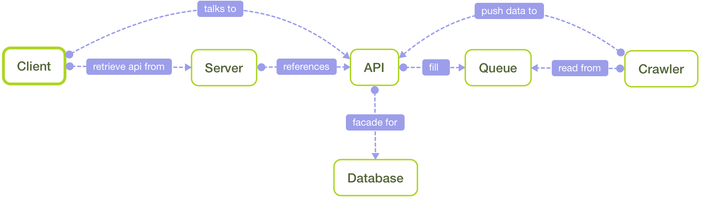
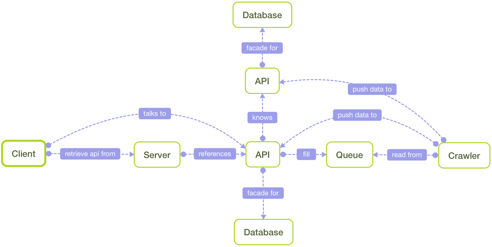
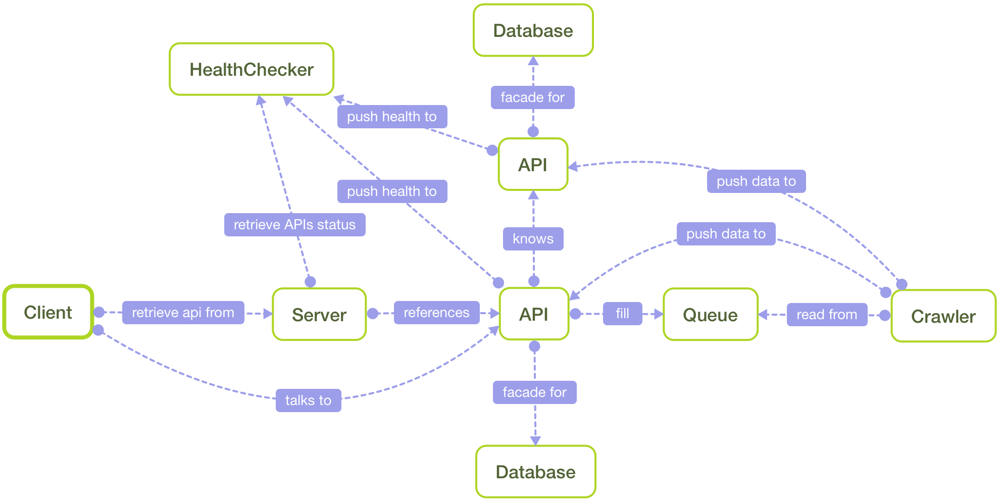
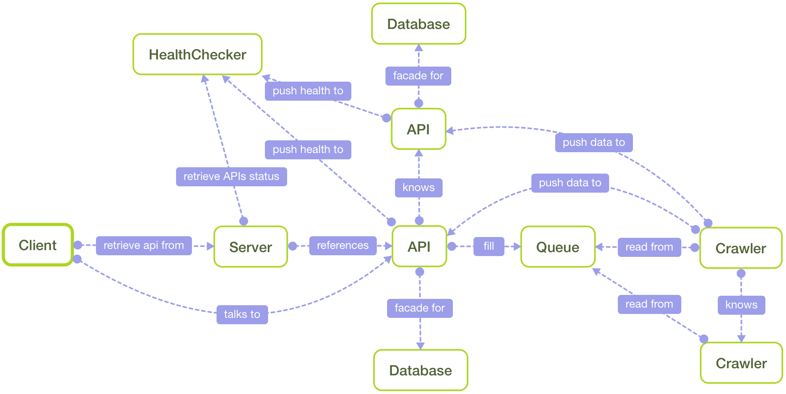

# Biologically Inspired Software~Infrastructure Orchestration

The goal of this paper is to try to find a way for a software to self manage it's infrastructure. The project used throughout as an example will be the crawling part of a search engine (of course :smiley:).

**Note**: Bear in mind that all ideas you'll find here are still concepts and have not been tried *yet*.

The problems I'll try to address:

* the scaling when it's not handled by your host provider
* the fault tolerance (machines crashing, server efficiency slowing down, etc...)
* service discovery

And all this with a minimum of human interaction, or if we go crazy *no* interaction.

**Disclaimer**: Yes, I'm aware of [Docker](https://www.docker.com/), [CoreOS](https://coreos.com/), [Consul.io](https://consul.io/) and [everything](http://bit.ly/1ft1xcA) (well maybe not *everything*). Just trying to think of something different here.

## Starting point

You can find below a schema of the basic infrastructure we want to handle. Basically we'll need the API, database and crawler parts to scale based on the load. We'll need to balance the API between the calls received from the clients and the crawlers; the crawlers based on the amount of messages accumulating in the queue.

**Note**: The couple API/Database is a 1:1 relation.

**Note 2**: The API/Queue/Crawler cycle is self sustained by following the [web link graph](https://en.wikipedia.org/wiki/Webgraph).

## Basic principles

Time to explain the meaning behind *biologically inspired*. Basically it falls down to 2 mechanisms: homeostasis and mitosis.

**Disclaimer**: I'm not a biologist, if something in this section is completely wrong please tell.

### Homeostasis

Meaning a dynamic balance. The notion is that for a system you can end up into 2 extremes:

* an ideal place where we have an abondance of what's needed
* a place where nothing can be achieved due to too many perturbations

One could think the first point is where we want to be, where in fact it's at an equivalent distance from both points.

Why not want the first case? It appears a system can become laxist and things start degrading with a balance moving quickly towards the other extreme, resulting in the fall of the whole system. (Example of such behaviour with the [mouse experiment](http://www.wikiwand.com/en/John_B._Calhoun#/Mouse_experiments) from John B. Calhoun)

This principle works from the cellular level to the social structure one.

[Wikipedia](https://en.wikipedia.org/wiki/Homeostasis)

### Mitosis

Mechanism used by cells to replicate themselves, either to sustain system growth or prevent having too many cells dying. The result of the duplication is an identical cell (or at least a close configuration), but in some cases you can end with unexpected mutations (trisomy, carcinogen cells, etc...).

[Wikipedia](https://en.wikipedia.org/wiki/Mitosis)

## Solving the problem

Here is a list of the bounds that could be used for our case:

* API: the number of request served to client and to the crawler
* Crawler: number of messages piling up, time to analyse a page slowing down over time

### API

The priority would be given to the number of responses to the client. In case of an increase of request, the system must slow down the number of messages sent to the queue (so it will receive less requests from crawlers) by using a temporary memory for example. But this slow down must be of short term, otherwise we won't be able to propose new results to the client.

So now we have a simple system to keep the balance at this level. But yet no mechanism in case the API is overloaded, and it's where the mitosis comes in. To lower the load it'll need a new server, the server will ask (somehow) the infrastructure to pop up a new blank machine (think stem cell). It will then install everything on it to mimic itself, once done it will remove any access it used to connect to the machine (for security); but will keep a reference to its existence.

The infrastructure may look like this now:

Because the API is smart, when the first instance view an increase demand from the clients, it can redirect the requests to the new API. Queue message can also be smart by instructing the crawler on which server to send its data; so in case the first API can't take the load from the crawlers it can tell them to send the new data to the new API server.

However, there's still a problem here. The server listing the available APIs still doesn't know about the new one. This is answerable by adding a new kind of server: a *health checker*.

Because the first API duplicated its configuration into the new one, the later will automatically push its own *health* to the health checker. And now the server listing the APIs can look at the health checker to see all the servers reporting to it (consequently it will discover the API).

Another advantage here is that the *front* server can more appropriately indicate which server to use for new clients, by sparing an API already under heavy load.

**Note**: here a new database has been created, but a better solution *may* be to use the same database for both API servers (if it's not creating a bottleneck, but we could check the database health to choose the best solution).

### Crawlers

The health indicator here is firstly based on the number of messages piling up in the queue. If a crawler detects it can now longer keep up, it will decrease its health indicator (because of too many pressure/stress). If the tendency is confirmed over time it will need to trigger *mitosis* (in this case to sustain growth).

The other indicator is how good the software is performing; is it slowing down due to hardware fatigue? If things don't move that much here, good it's keeping its balance, otherwise time to trigger *mitosis* to prevent death.

Like for the APIs above, the crawler will create a new server, duplicate it's configuration then close the connection while keeping a reference to this new crawler.

Because the crawler duplicated its configuration, the new one will automatically listen from the queue. The reference between the two crawlers may not be very important in this case, but maybe it could be useful to know the children health one created.

It may also be interesting that each crawler push its health status to the health checker, and let it know that there should always be at least one crawler in the system. In case all die, the health checker could send a notification to the sysadmin or better yet, trigger a factory to inject brand new crawlers in the system.

## Conclusion

With two simple principles we can build a system with a complex behaviour able to adapt in real time to its environment, to make sure everything run as stable as possible.

What it can achieve is very similar to the tools we have right now, but instead of having a relation master/slave where a processus will know if it needs to add new instances of the servers it governs, it shifts the relationship in a more horizontal way. I believe a server will have a better insight on how it's doing; even though it will lack an overall point of view, it will have a better intuition thanks to its own knowledge and the one of its near neighboors. It's a mechanism working pretty well for living organisms, so why not for *cold* ones?

However, such mechanism raise some questions such as how to create a new server? In case your host provider expose an API to control everything on its infrastructure it will be easy to ask for a server. But it raise another question: if the system can buy new servers automatically, how do you prevent it from draining your bank account? A solution could be to have a fixed pool of servers, with ones powered off, and powered back on when needed (it also fix the problem in case your host provider doesn't have an API). More questions may come up, but there's surely an answer for each one.

Last but not least, it's no longer possible to plan how much your infrastructure will cost you (except if you go for the fixed pool of servers). But the good news is that will more closely cost what it actually needs to run safely.

**Last note**: bear in mind that this kind of system may not be applicable to every kind of project. A simple monolithic app with a constant load won't need such mechanism.

**Last note bis**: I invite you to open an [issue](https://github.com/Innmind/Research-N-Devleopment/issues) to start any kind of discussion or a [PR](https://github.com/Innmind/Research-N-Devleopment/pulls) to fix typos, enhance the writing or else.
